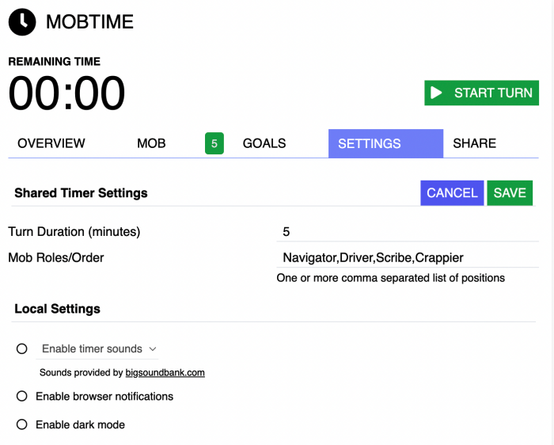

# Crappy Driven-Development (CDD)
Let's learn a new development practice : Crappy-Driven Development.
`The secret art of making yourself indispensable by writing crappy code !!!`

## Kata
In small groups / [mob](https://www.youtube.com/watch?v=SHOVVnRB4h0&ab_channel=GOTOConferences) :
* Choose a code in a language you want to work with (`C#`, `java`, `scala`, `js`)
* Your objective : Apply CDD to make the code so crappy that other groups won't be able to understand it
  * Follow the golden rules described below

  * Make it in Baby steps (crappy 1 thing at a time)
* You have 30 minutes to make as many cycles as possible :
  * Make it in mob
  * Be creative
  * The more brainfuck it is the better
  * Tests are green before and at the end of your refactoring

### Mob roles
I recommend to use [mobtime](https://mobti.me/) and configure below roles :
* Turn Duration : 5 minutes
* Create the 4 roles presented below

#### Driver

* Write the code according to the navigator's specification
* Listen intently to the navigators instructions
* Ask questions wherever there is a lack of clarity

#### Navigator

* Dictates the code that is to be written - the 'what'
* Clearly communicates what code to write
* Explains 'why' they have chosen the particular solution to this problem
* Check for syntax / type errors as the Driver drives

#### Scribe

* Write down the goals of each cycle in mobtime
* Explain why it has been decided

#### Crappier

* Anticipate what can be crappier
* Write down ideas that emerge in his/he mind and other ideas as well

### Review
At the end of the 30 minutes period : 
* Each mob presents the new version of the production code
* Other groups have 2 minutes to identify what is implemented

### Reflect
Take a few minutes to reflect and ask questions :
* Based on your mob refactoring list, which patterns did you observe recently in your codebase ?
* What did you learn from this kata ?
* How this practice can be applied in your current context ? 😜

## Why this kata ?
* By having a reversed reflexion (How can I make my code the crappiest possible), people think outside of the box
* The list of implemented crappy refactoring serve as an anti-patterns list :
  * All the code smells they must avoid in their own code
  * Stuff to fight against
* Learn Mob Programming
* Practice automated refactoring : rename, move, extract, ...
* Because it's fun 😊

